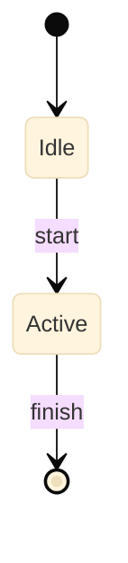

<!--
  SPEC TEMPLATE — copy this to features/F##-name.md or foundations/E##-name.md.
  Fill the <placeholders>, delete sections you don't need, and delete these
  HTML comments as you go. Before writing any body text, read references/writing-style.md.
  Always keep Purpose, Detailed Specification, Cross-References, and Changelog.
-->

# F## — <Feature Name>

> **Status:** Draft
>
> **Version:** 0.1   ·   **Last updated:** <YYYY-MM-DD>
>
> **Purpose:** <One or two sentences. What this spec defines and what it delivers. If you can't say it in two sentences, the spec is doing too much.>
>
> **Depends on:** [<spec>](<path>.md)   ·   **Related:** [<spec>](<path>.md)

> Requirement tag: **<TAG>**   <!-- short uppercase prefix for REQ-<TAG>-NN; delete this line if the spec won't use requirement IDs -->

---

## 1. Purpose & Scope

<!-- Open with the plain-language summary, then list what's in scope. -->

<One-sentence plain-language summary of what this feature is.>

This spec covers:

- <in-scope item>
- <in-scope item>

## 2. Non-Goals / Out of Scope

<!-- What this deliberately excludes, and who owns it instead. -->

- <thing this spec does NOT cover> — owned by [<spec>](<path>.md).

## 3. Background & Rationale

<!-- Why this exists and how it fits the whole. Keep it short. -->

<Context the reader needs to follow the decisions below.>

## 4. Concepts & Definitions

<!-- Terms used or introduced. Canonical terms → link to glossary.md instead of redefining. -->

- **<Term>** — <definition>. (Canonical definition in [glossary](../glossary.md).)

## 5. Detailed Specification

<!-- The body. Use numbered subsections. Lead each with a plain summary.
     If using requirement IDs, give each load-bearing rule a REQ-<TAG>-NN. -->

### 5.1 <Subsection — e.g. Routes>

<Plain-language summary of this subsection.>

**REQ-<TAG>-01 — <short title of the rule>.**

<The rule, one idea per sentence. State pre/postconditions where they matter.>

### 5.2 Data Shapes & Code Map

<Say what these shapes are before showing them. Quote the owning structs or the
feature's pure-function signatures; open the block with a file-path comment.>

```rust
// src/state/mod.rs
pub struct <Name>Record {
    pub uri: Uri,
    pub range: Range,
    // ...
}
```

<Then explain ownership and invariants in prose, and close with the file map —
e.g. "Files: `features/<name>.rs`. No state, no errors — empty index means
empty result.">

<!-- The product has no screens (constitution §6) — describe editor surfaces
     (hover cards, completion popups, diagnostics) in prose, never ASCII mockups. -->

## 6. Visualizations

<!-- Mermaid for flows/lifecycles, tables for matrices.
     Follow references/mermaid.md — init block, labeled arrows, colored nodes. -->



## 7. Data Shapes

<!-- Concrete payloads crossing a boundary. Quote verbatim — it's a contract. -->

```json
{ "id": "string", "createdAt": "ISO-8601" }
```

## 8. Examples & Use Cases

<!-- Walk a realistic scenario using the constitution's example cast. -->

<A concrete walk-through with the recurring characters/data.>

## 9. Edge Cases & Failure Modes

<!-- Empty states, failures, races, conflicting input. Not just the happy path. -->

- <case> → <behavior>.

## 10. Open Questions & Decisions

<!-- Undecided items as OQ-<TAG>-NN; record resolved decisions too. -->

- **OQ-<TAG>-1** — <open question>.

## 11. Cross-References

<!-- The complete list of connected specs, grouped like the header. -->

- **Depends on:** [<spec>](<path>.md) — <why>.
- **Related:** [<spec>](<path>.md) — <why>.

## 12. Changelog

<!-- Newest first. ISO dates. Narrative entries — what changed and why.

     Template's own changelog (delete with the other comments when you copy):
     - 2026-06-12 — §5.2 example switched from the Dart/Drift placeholder to the
       suite's Rust "Data Shapes & Code Map" convention; ASCII "Screens" section
       deleted (constitution §6: the product has no screens). -->

- **<YYYY-MM-DD>** — Initial draft.
