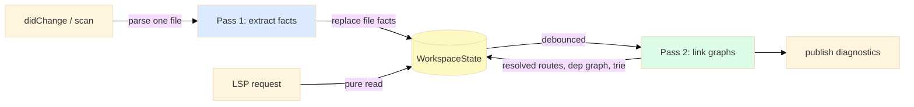

# E01 — Architecture

> **Status:** Draft
>
> **Version:** 0.1   ·   **Last updated:** 2026-06-12
>
> **Purpose:** The system shape: one Rust binary, a two-pass index, and pure-function features. Read this before any feature spec.
>
> **Depends on:** [constitution](../constitution.md)   ·   **Related:** [E07-data-model](E07-data-model.md), [E02-folder-structure](E02-folder-structure.md)

> Requirement tag: **ARCH**

---

## 1. Purpose & Scope

This spec defines how the server is put together: its process model, the two-pass indexing pipeline, how files are detected and parsed, and how LSP features read the result. Feature specs assume everything here.

## 2. Non-Goals / Out of Scope

- The concrete index types — owned by [E07-data-model](E07-data-model.md).
- What each feature does with the index — owned by the `F##` specs.
- Test harness details — owned by [E17-testing](E17-testing.md).

## 3. Background & Rationale

The shape — an LSP framework crate, tree-sitter parsing, concurrent-map state — is the one production Rust language servers converge on. What's specific to this server is the **second pass**: a FastAPI route's identity spans files — its final path depends on `include_router` calls made somewhere else entirely — so per-file extraction alone can't answer "what is this route's URL?", and a workspace-level linking step becomes the heart of the design.

## 4. Concepts & Definitions

Fact, linking, resolved path, and WorkspaceState are canonical in the [glossary](../glossary.md). One term is specific to this spec:

- **Debounce window** — the short delay after a pass-1 change before pass 2 re-runs, so a burst of keystrokes triggers one re-link, not twenty.

## 5. Detailed Specification

### 5.1 Process model

The server is one binary speaking LSP over stdio; that's the whole deployment story.

**REQ-ARCH-01 — Single static binary, stdio first.**

The server ships as one Rust binary with no runtime dependencies. The `lsp` subcommand speaks JSON-RPC over stdio by default, with HTTP as a debug transport, and a `check` subcommand runs the same pipeline as a one-shot linter — the full CLI surface is [F17](../features/F17-cli.md). `tower-lsp-server` handles the framing ([E03](E03-tech-stack.md)); all request handlers live in one `impl LanguageServer for Backend`.

**REQ-ARCH-02 — Static analysis only.**

The server never executes user code, imports user modules, or shells out to Python (constitution P1). tree-sitter-python is the only source of truth about user code, and it is the only parser (no regex extraction).

### 5.2 The two-pass pipeline

Everything the server knows flows through two passes: extract per file, then link across files.

**REQ-ARCH-03 — Pass 1 runs per file, on every change.**

On `didOpen`, `didChange`, `didSave`, and during the initial workspace scan, the changed file is parsed and its facts extracted: route decorators, `APIRouter` declarations, `include_router` calls, `Depends` references, template usages, Pydantic models, client calls in tests. The file's old facts are replaced atomically. Pass 1 touches only that one file.

**REQ-ARCH-04 — Pass 2 links the workspace, debounced.**

After any pass-1 change, a debounced pass 2 rebuilds the workspace-level indices from the facts: it walks the router graph to compute resolved paths, binds `Depends` names to definitions, rebuilds the path trie, and re-matches test calls. Pass 2 is a pure in-memory walk over facts — it re-parses nothing — so rebuilding it wholesale is cheap and keeps the linking logic simple (no incremental-graph bookkeeping to get wrong).

Diagnostics are published after pass 2 completes, since most checks need linked data.

### 5.3 File detection

A workspace scan must not parse every Python file in a large monorepo, so cheap indicators gate the parse.

**REQ-ARCH-05 — Indicator-gated scanning, force-parse on open.**

During the workspace scan, a file is parsed only if it contains an indicator substring: `from fastapi`, `import fastapi`, `from starlette`, `import starlette`, `APIRouter`, or `TestClient`. On `didOpen`/`didChange`/`didSave` the file is parsed unconditionally (`force_parse = true`), so features work in files that merely *use* the framework objects.

`fastapi-lsp.toml` and `pyproject.toml` are watched too; a change re-runs config resolution ([E15](E15-app-config.md)) and triggers pass 2.

### 5.4 Feature dispatch

**REQ-ARCH-06 — Features are pure functions.**

Every LSP capability is a function in `src/features/` taking `&WorkspaceState` plus the request's URI/position, returning the LSP response type. Features hold no state and take no locks beyond DashMap's per-entry reads, so concurrent requests just work.

### 5.5 Resilience

**REQ-ARCH-07 — Partial code degrades, never breaks.**

Extractors walk whatever tree tree-sitter produced — including `ERROR` nodes — and return the facts they can find (constitution P3). A fact that can't be fully resolved (a prefix that isn't a literal or module-level string constant) is stored as `Unresolved` and excluded from cross-route checks rather than guessed at (P4). A request handler that hits a bug must return an empty/null LSP response, never crash the process.

### 5.6 Protocol conduct

Rules from the LSP spec and ecosystem hard-won experience that the implementation must honor from day one — each is cheap to build in and expensive to retrofit.

**REQ-ARCH-08 — Document notifications apply in order; parsing never blocks the runtime.**

`tower-lsp-server` runs handlers concurrently by default, which can apply two `didChange` events out of order and silently corrupt the stored source (the upstream issue-#284 pitfall). Document mutations must be serialized — per-document ordering at minimum (a `concurrency_level(1)` server setting is the acceptable v1 hammer). CPU-bound work (tree-sitter parsing, pass 2) runs under `tokio::task::spawn_blocking`, never directly in an async handler.

**REQ-ARCH-09 — Position encoding is negotiated, preferring UTF-8.**

The server advertises `positionEncoding: "utf-8"` when the client offers it (LSP 3.17) and falls back to the mandatory UTF-16 — counting UTF-16 code units, surrogate pairs included — otherwise. All offset conversion goes through one utility module; nothing else touches line/character math. [E17](E17-testing.md) REQ-TST-03 pins the edge cases.

**REQ-ARCH-10 — Diagnostics are published for every file whose set changed — including to empty.**

After each relink, files whose diagnostics disappeared get an explicit empty `publishDiagnostics`, or stale squiggles linger forever. Closed files are cleared the same way.

**REQ-ARCH-11 — The workspace scan never blocks `initialize`.**

`initialize` returns immediately; scanning runs in the background after `initialized`, reporting via `window/workDoneProgress` so large workspaces see a progress bar instead of a frozen editor. Requests arriving mid-scan answer from whatever is indexed so far.

**REQ-ARCH-12 — The index follows the disk: file watching is mandatory.**

The server registers `workspace/didChangeWatchedFiles` (dynamically when the client supports it, with a static-capability fallback) for: `**/*.py`, `fastapi-lsp.toml`, `pyproject.toml`, every configured or discovered env file ([E15 REQ-CFG-05](E15-app-config.md)), and everything under each template root. The handler keeps the index honest against changes the editor didn't make — git checkouts, generators, deletions in a file tree:

- **Created** → run pass 1 on the new file (indicator-gated, like the scan) or add it to the template/env index; relink.
- **Changed** (a file *not* open in the editor) → re-extract from disk; relink. For *open* files the editor's `didChange` buffer is the truth — watcher events for open documents are ignored.
- **Deleted** → drop the file's facts (or template/env entries); relink. Routes, dependencies, and templates that lived there vanish from every index, and their diagnostics clear per REQ-ARCH-10.

Renames arrive as a delete+create pair and need no special handling. Template roots and config files additionally trigger config re-resolution ([E15](E15-app-config.md)) before the relink.

## 6. Examples & Use Cases

You type a new handler in `app/routers/books.py`. Pass 1 re-extracts that file's facts on each keystroke — cheap, single-file. You pause; the debounce fires; pass 2 walks the router graph and your new route appears in workspace symbols as `GET /api/books/{book_id}` with its prefix chain resolved through `app/main.py`'s `include_router(books.router, prefix="/api")` — a file you never touched.

## 7. Edge Cases & Failure Modes

- A file is deleted → its facts are removed and pass 2 re-runs; routes that lived there vanish from the index.
- Two files define `router` → no conflict: facts are keyed by file, and chains are resolved through the importing file's `include_router` target.
- Syntax error mid-edit → pass 1 extracts what it can; previously-resolved routes from other files are untouched.
- Huge workspace, no FastAPI → scan finds no indicators, parses nothing, idles at near-zero cost.

## 8. Open Questions & Decisions

- **OQ-ARCH-1** — Debounce window length: start at 300 ms and tune against a large fixture workspace.
- **Decision** — Pass 2 rebuilds wholesale instead of incrementally. Simplicity wins until a real workspace proves it too slow (P6 gives the budget).

## 9. Cross-References

- **Depends on:** [constitution](../constitution.md) — principles P1, P3, P4, P6 cited above.
- **Related:** [E07-data-model](E07-data-model.md) — the indices pass 2 builds; [E15-app-config](E15-app-config.md) — config files watched; [E17-testing](E17-testing.md) — how the pipeline is tested.

## 10. Changelog

- **2026-06-12** — Added REQ-ARCH-12: mandatory file watching (create/change/delete, open-buffer precedence, rename-as-pair) centralizing what F05/F09/E15 referenced piecemeal.
- **2026-06-12** — Added §5.6 Protocol conduct (REQ-ARCH-08…11: notification ordering + spawn_blocking, position-encoding negotiation, diagnostic clearing, non-blocking scan with progress) from LSP-ecosystem research; switched framing crate reference to `tower-lsp-server`. Touches [E03](E03-tech-stack.md), [E17](E17-testing.md).
- **2026-06-12** — Initial draft: two-pass pipeline, indicator gating, pure-function features.
